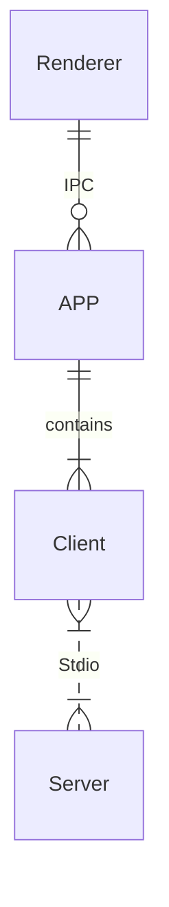

# Chat MCP

An example of a framework that leverages MCP(Model Context Protocol) to interface with other LLMs.

```mermaid
erDiagram
    Renderer ||--o{ APP : IPC
    APP ||--|{ Client : contains
    Client }|..|{ Server : Stdio
```
