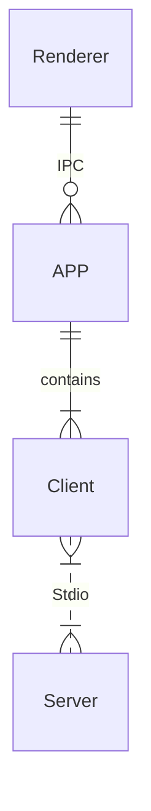

# Chat MCP

An example of a framework that leverages MCP(Model Context Protocol) to interface with other LLMs.

This example has been tested exclusively on Windows, but Electron itself is cross-platform.

The goal is to provide the SIMPLEST possible code to help you understand the principles of MCP.

## Architecture



Only 3 key files: `main.ts`, `client.ts`, `preload.ts`

The files in src/mcp-file-test are not utilized; they are solely for reference purposes.

## Configuration

Create a `.json` file and paste the following content into it. This file can then be provided as the interface configuration for the Chat UI.

```json
{
    "chatbotStore": {
        "apiKey": "",
        "url": "https://api.aiql.com",
        "path": "/v1/chat/completions",
        "model": "gpt-4o-mini",
        "max_tokens_value": "",
        "mcp": true
    },
    "defaultChoiceStore": {
        "model": [
            "gpt-4o-mini",
            "gpt-4o",
            "gpt-4",
            "gpt-4-turbo"
        ]
    }
}
```

You can replace the 'url' if you have direct access to the OpenAI API.

Alternatively, you can also use another API endpoint that supports function calls.
