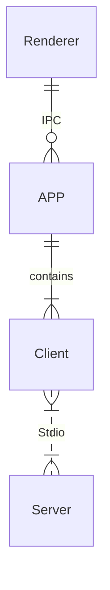
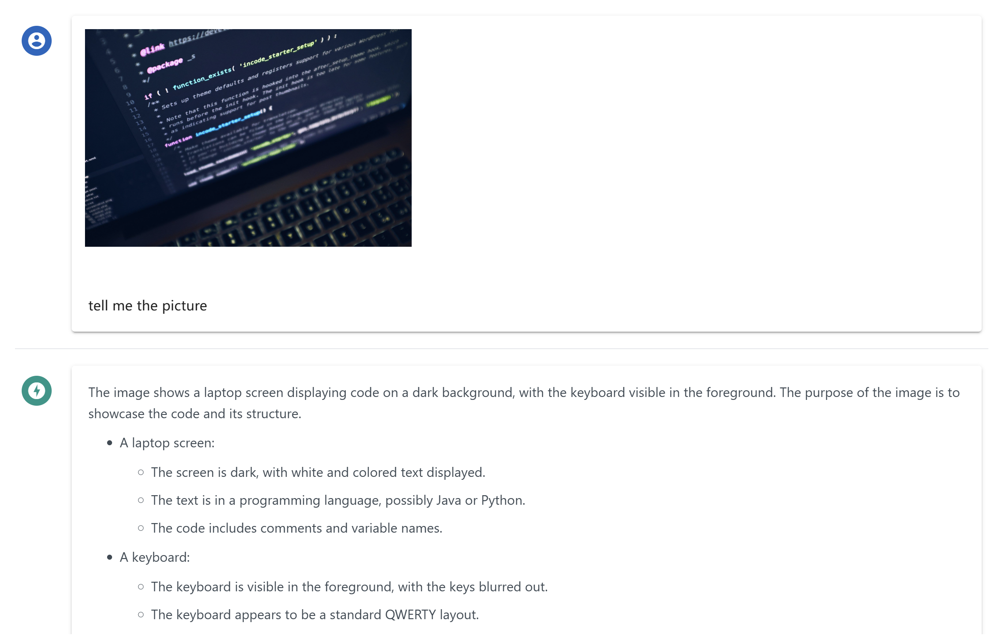
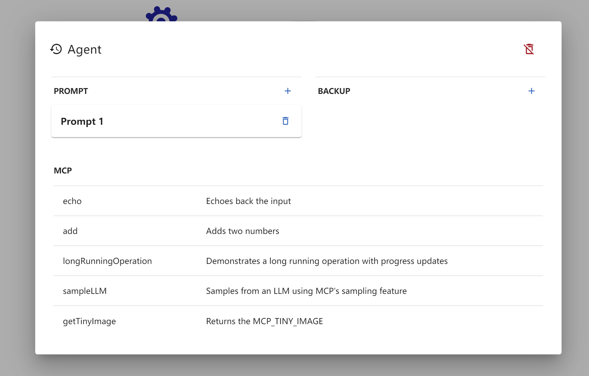
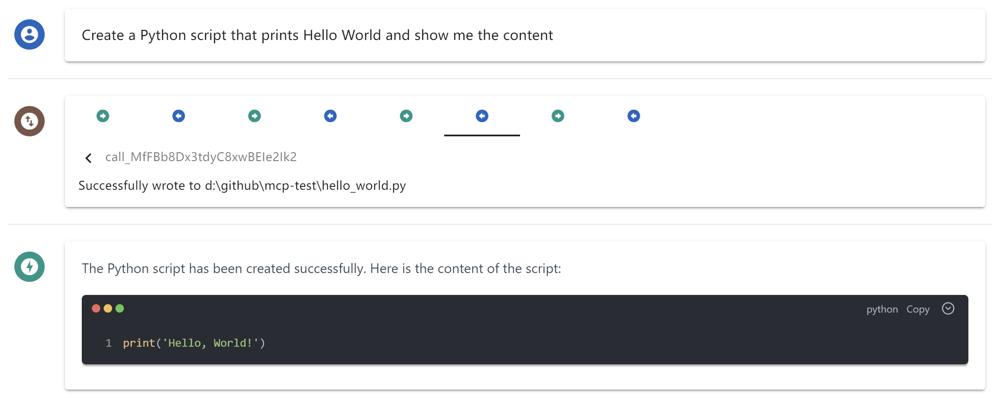
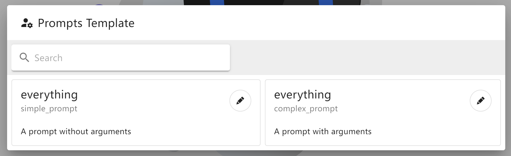
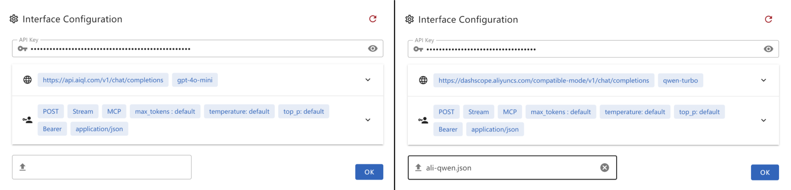
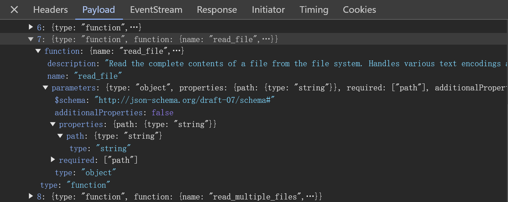

# MCP Chat Desktop App
## A Cross-Platform Interface for LLMs

This desktop application utilizes the MCP (Model Context Protocol) to seamlessly connect and interact with various Large Language Models (LLMs). Built on Electron, the app ensures full cross-platform compatibility, enabling smooth operation across different operating systems.

The primary objective of this project is to deliver a clean, minimalistic codebase that simplifies understanding the core principles of MCP. Additionally, it provides a quick and efficient way to test multiple servers and LLMs, making it an ideal tool for developers and researchers alike.

## Features

- Cross-Platform Compatibility: Supports Linux, macOS, and Windows.

- Flexible Apache-2.0 License: Allows easy modification and building of your own desktop applications.

- Dynamic LLM Configuration: Compatible with all OpenAI SDK-supported LLMs, enabling quick testing of multiple backends through manual or preset configurations.

- Multi-Client Management: Configure and manage multiple clients to connect to multiple servers using MCP config.

- UI Adaptability: The UI can be directly extracted for web use, ensuring consistent ecosystem and interaction logic across web and desktop versions.


## Architecture



Only 3 key files: `main.ts`, `client.ts`, `preload.ts`

## How to use

1. `npm install`

2. `npm start`

## Configuration

Create a `.json` file and paste the following content into it. This file can then be provided as the interface configuration for the Chat UI.

- `gtp-api.json`

    ```json
    {
        "chatbotStore": {
            "apiKey": "",
            "url": "https://api.aiql.com",
            "path": "/v1/chat/completions",
            "model": "gpt-4o-mini",
            "max_tokens_value": "",
            "mcp": true
        },
        "defaultChoiceStore": {
            "model": [
                "gpt-4o-mini",
                "gpt-4o",
                "gpt-4",
                "gpt-4-turbo"
            ]
        }
    }
    ```

You can replace the 'url' if you have direct access to the OpenAI API.

Alternatively, you can also use another API endpoint that supports function calls: 

- `qwen-api.json`

    ```json
    {
        "chatbotStore": {
            "apiKey": "",
            "url": "https://dashscope.aliyuncs.com/compatible-mode",
            "path": "/v1/chat/completions",
            "model": "qwen-turbo",
            "max_tokens_value": "",
            "mcp": true
        },
        "defaultChoiceStore": {
            "model": [
                "qwen-turbo",
                "qwen-plus",
                "qwen-max"
            ]
        }
    }
    ```


## Troubleshooting

#### Error: spawn npx ENOENT - [ISSUE 40](https://github.com/modelcontextprotocol/servers/issues/40)

Modify the `config.json` in src/

On windows, npx may not work, please refer my workaround: [ISSUE 101](https://github.com/modelcontextprotocol/typescript-sdk/issues/101)

- Or you can use `node` in config.json: 
    ```json
    {
        "mcpServers": {
            "filesystem": {
            "command": "node",
            "args": [
                "node_modules/@modelcontextprotocol/server-filesystem/dist/index.js",
                "D:/Github/mcp-test"
            ]
            }
        }
    }
    ```

Please ensure that the provided path is valid, especially if you are using a relative path. It is highly recommended to provide an absolute path for better clarity and accuracy.

By default, I will install `server-everything`, `server-filesystem`, and `server-puppeteer` for test purposes. However, you can install additional server libraries or use `npx` to utilize other server libraries as needed.


## Demo

### Multimodal Support


### MCP Tools Visualization


### MCP Toolcall Process Overview


### MCP Prompts Template


### Dynamic LLM Config


### DevTool Troubleshooting

