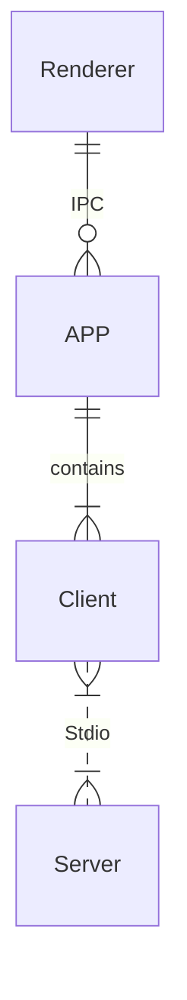

# MCP Chat Desktop App
## A Cross-Platform Interface for LLMs

This desktop application utilizes the MCP (Model Context Protocol) to seamlessly connect and interact with various Large Language Models (LLMs). Built on Electron, the app ensures full cross-platform compatibility, enabling smooth operation across different operating systems.

The primary objective of this project is to deliver a clean, minimalistic codebase that simplifies understanding the core principles of MCP. Additionally, it provides a quick and efficient way to test multiple servers and LLMs, making it an ideal tool for developers and researchers alike.

## Features

- Cross-Platform Compatibility: Supports Linux, macOS, and Windows.

- Flexible Apache-2.0 License: Allows easy modification and building of your own desktop applications.

- Dynamic LLM Configuration: Compatible with all OpenAI SDK-supported LLMs, enabling quick testing of multiple backends through manual or preset configurations.

- Multi-Client Management: Configure and manage multiple clients to connect to multiple servers using MCP config.

- UI Adaptability: The UI can be directly extracted for web use, ensuring consistent ecosystem and interaction logic across web and desktop versions.


## Architecture

Adopted a straightforward architecture consistent with the MCP documentation to facilitate a clear understanding of MCP principles.



Only three key files need to be understood: `main.ts`, `client.ts`, and `preload.ts`, to grasp the essence of the project.

## How to use

After cloning or downloading this repository:

1. Please modify the `config.json` file located in [src/main](src/main).  
   Ensure that the `command` and `path` specified in the `args` are valid.

2. Please ensure that [Node.js](https://nodejs.org/) is installed on your system.  
   You can verify this by running `node -v` and `npm -v` in your terminal to check their respective versions.

3. `npm install`

4. `npm start`

## Configuration

Create a `.json` file and paste the following content into it. This file can then be provided as the interface configuration for the Chat UI.

- `gtp-api.json`

    ```json
    {
        "chatbotStore": {
            "apiKey": "",
            "url": "https://api.aiql.com",
            "path": "/v1/chat/completions",
            "model": "gpt-4o-mini",
            "max_tokens_value": "",
            "mcp": true
        },
        "defaultChoiceStore": {
            "model": [
                "gpt-4o-mini",
                "gpt-4o",
                "gpt-4",
                "gpt-4-turbo"
            ]
        }
    }
    ```

You can replace the 'url' if you have direct access to the OpenAI API.

Alternatively, you can also use another API endpoint that supports function calls: 

- `qwen-api.json`

    ```json
    {
        "chatbotStore": {
            "apiKey": "",
            "url": "https://dashscope.aliyuncs.com/compatible-mode",
            "path": "/v1/chat/completions",
            "model": "qwen-turbo",
            "max_tokens_value": "",
            "mcp": true
        },
        "defaultChoiceStore": {
            "model": [
                "qwen-turbo",
                "qwen-plus",
                "qwen-max"
            ]
        }
    }
    ```

- `deepinfra.json`

    ```json
    {
        "chatbotStore": {
            "apiKey": "",
            "url": "https://api.deepinfra.com",
            "path": "/v1/openai/chat/completions",
            "model": "meta-llama/Meta-Llama-3.1-70B-Instruct",
            "max_tokens_value": "32000",
            "mcp": true
        },
        "defaultChoiceStore": {
            "model": [
                "meta-llama/Meta-Llama-3.1-70B-Instruct",
                "meta-llama/Meta-Llama-3.1-405B-Instruct",
                "meta-llama/Meta-Llama-3.1-8B-Instruct"
            ]
        }
    }
    ```

## Build Application

You can build your own desktop application by:

```bash
npm run build-app
```

This CLI helps you build and package your application for your current OS, with artifacts stored in the /artifacts directory.

For Debian/Ubuntu users experiencing RPM build issues, try one of the following solutions: 

- Edit `package.json` to skip the RPM build step. Or 

- Install `rpm` using `sudo apt-get install rpm` (You may need to run `sudo apt update` to ensure your package list is up-to-date)


# Troubleshooting

## Error: spawn npx ENOENT - [ISSUE 40](https://github.com/modelcontextprotocol/servers/issues/40)

Modify the `config.json` in [src/main](src/main)

On windows, npx may not work, please refer my workaround: [ISSUE 101](https://github.com/modelcontextprotocol/typescript-sdk/issues/101)

- Or you can use `node` in config.json: 
    ```json
    {
        "mcpServers": {
            "filesystem": {
            "command": "node",
            "args": [
                "node_modules/@modelcontextprotocol/server-filesystem/dist/index.js",
                "D:/Github/mcp-test"
            ]
            }
        }
    }
    ```

Please ensure that the provided path is valid, especially if you are using a relative path. It is highly recommended to provide an absolute path for better clarity and accuracy.

By default, I will install `server-everything`, `server-filesystem`, and `server-puppeteer` for test purposes. However, you can install additional server libraries or use `npx` to utilize other server libraries as needed.

## Installation timeout

Generally, after executing `npm install` for the entire project, the total size of files in the `node_modules` directory typically exceeds 500MB. 

If the installation process stalls at less than 300MB and the progress bar remains static, it is likely due to a timeout during the installation of the latter part, specifically Electron.

This issue often arises because the download speed from Electron's default server is excessively slow or even inaccessible in certain regions. To resolve this, you can modify the environment or global variable `ELECTRON_MIRROR` to switch to an Electron mirror site that is accessible from your location.

## Electron builder timeout

When using electron-builder to package files, it automatically downloads several large release packages from GitHub. If the network connection is unstable, this process may be interrupted or timeout.

On Windows, you may need to clear the cache located under the `electron` and `electron-builder` directories within `C:\Users\YOURUSERNAME\AppData\Local` before attempting to retry.

Due to potential terminal permission issues, it is recommended to use the default shell terminal instead of VSCode's built-in terminal.

## Demo

### Multimodal Support


### Reasoning and Latex Support


### MCP Tools Visualization


### MCP Toolcall Process Overview


### MCP Prompts Template


### Dynamic LLM Config


### DevTool Troubleshooting

