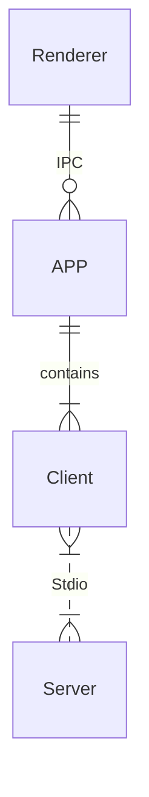

# Chat MCP

An example of a framework that leverages MCP(Model Context Protocol) to interface with other LLMs.

This example has been tested exclusively on Windows, but Electron itself is cross-platform.

The goal is to provide the SIMPLEST possible code to help you understand the principles of MCP.

## Demo


## Architecture



Only 3 key files: `main.ts`, `client.ts`, `preload.ts`

## How to use

1. `npm install`

2. `npm start`

## Configuration

Create a `.json` file and paste the following content into it. This file can then be provided as the interface configuration for the Chat UI.

- `gtp-api.json`

    ```json
    {
        "chatbotStore": {
            "apiKey": "",
            "url": "https://api.aiql.com",
            "path": "/v1/chat/completions",
            "model": "gpt-4o-mini",
            "max_tokens_value": "",
            "mcp": true
        },
        "defaultChoiceStore": {
            "model": [
                "gpt-4o-mini",
                "gpt-4o",
                "gpt-4",
                "gpt-4-turbo"
            ]
        }
    }
    ```

You can replace the 'url' if you have direct access to the OpenAI API.

Alternatively, you can also use another API endpoint that supports function calls: 

- `qwen-api.json`

    ```json
    {
        "chatbotStore": {
            "apiKey": "",
            "url": "https://dashscope.aliyuncs.com/compatible-mode",
            "path": "/v1/chat/completions",
            "model": "qwen-turbo",
            "max_tokens_value": "",
            "mcp": true
        },
        "defaultChoiceStore": {
            "model": [
                "qwen-turbo",
                "qwen-plus",
                "qwen-max"
            ]
        }
    }
    ```


## Troubleshooting

#### Error: spawn npx ENOENT - [ISSUE 40](https://github.com/modelcontextprotocol/servers/issues/40)

Modify the `config.json` in src/

On windows, npx may not work, please refer my workaround: [ISSUE 101](https://github.com/modelcontextprotocol/typescript-sdk/issues/101)

- Or you can use `node` in config.json: 
    ```json
    {
        "mcpServers": {
            "filesystem": {
            "command": "node",
            "args": [
                "node_modules/@modelcontextprotocol/server-filesystem/dist/index.js",
                "D:/Github/mcp-test"
            ]
            }
        }
    }
    ```

Please ensure that the provided path is valid, especially if you are using a relative path. It is highly recommended to provide an absolute path for better clarity and accuracy.

By default, I will install `server-everything`, `server-filesystem`, and `server-puppeteer` for test purposes. However, you can install additional server libraries or use `npx` to utilize other server libraries as needed.

